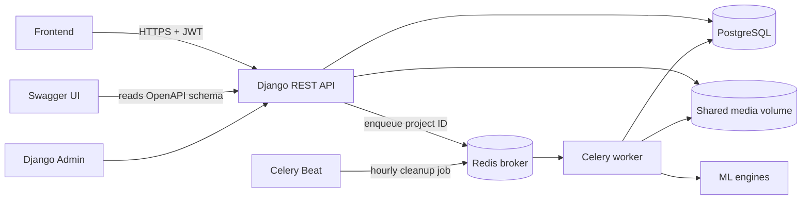
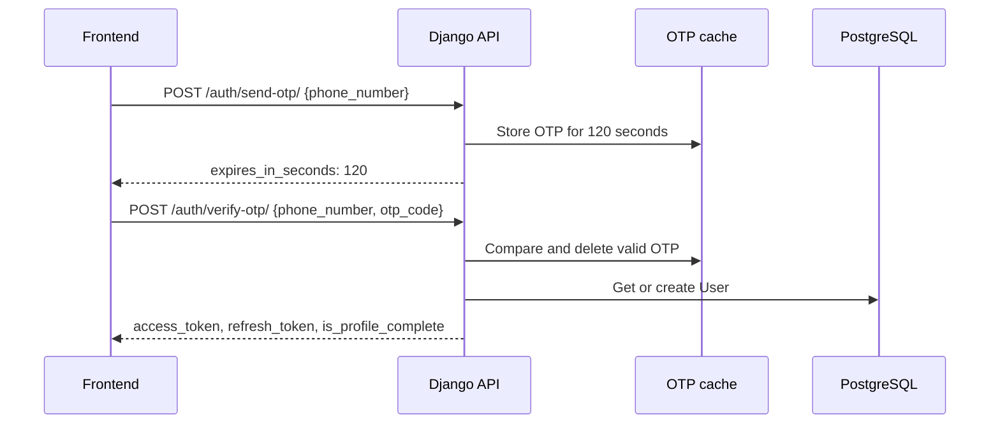
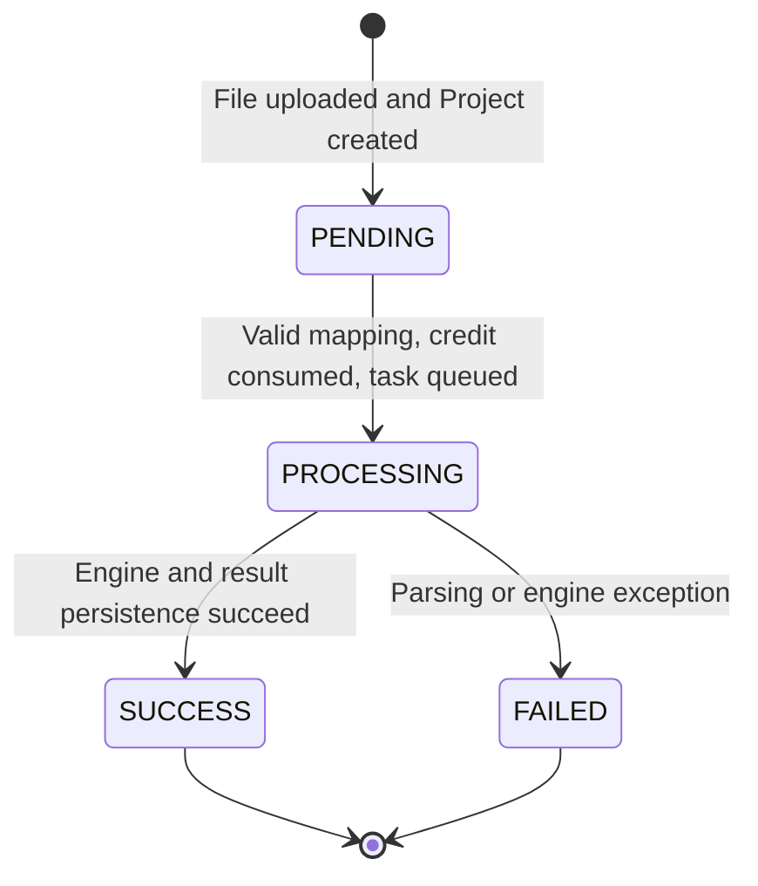
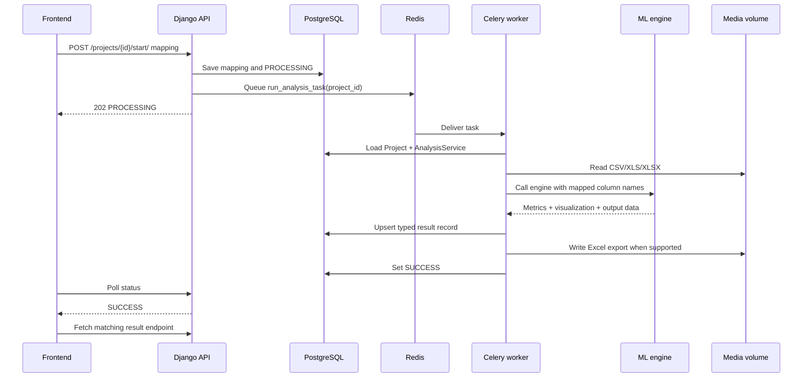
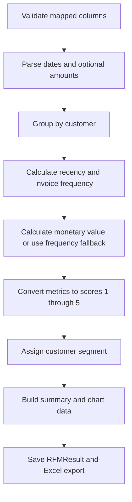
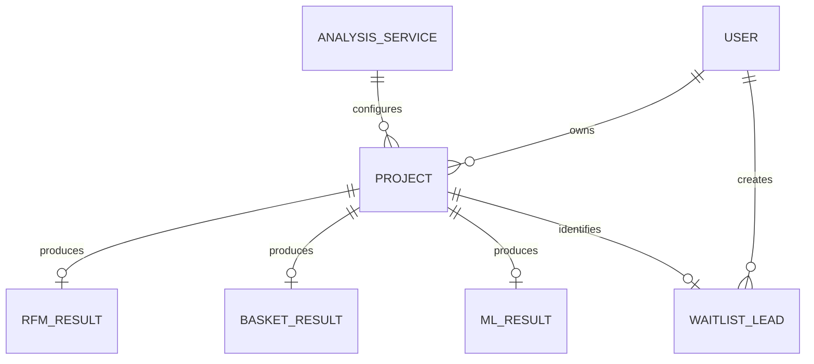

# Backend Technical Flow

## Purpose

The backend accepts customer transaction files, stores project metadata, runs analytics outside the HTTP request, and returns chart-ready results. Django handles API and admin work, PostgreSQL stores permanent records, Redis carries background jobs and OTP values, Celery runs analytics, and the `ml_engines` package contains data-processing code without Django dependencies.

## Runtime architecture

All containers that read uploaded files or write exports share the same `media` volume. The API stores only file paths and structured results in the database.

## Main modules and responsibilities

| Module | Responsibility |
| --- | --- |
| `mlaas/settings.py` | Database, JWT, Redis, Celery, media, OpenAPI, and application configuration |
| `mlaas/urls.py` | Root API, admin, OpenAPI schema, and Swagger routes |
| `apps/authentication` | Phone-based users, OTP verification, JWT creation, and business profiles |
| `apps/analytics/models.py` | Service catalog, projects, result records, and waitlist leads |
| `apps/analytics/views.py` | Upload, mapping, queueing, polling, result, and waitlist HTTP flows |
| `apps/analytics/tasks.py` | Celery adapter between projects and the four ML engines |
| `apps/analytics/cron.py` | Deletes raw uploads older than 48 hours |
| `ml_engines` | Validates tabular data and performs analytics without importing Django |

## Authentication flow

`apps.authentication.services.send_otp()` currently stores the fixed MVP code `123456`. A `TODO` marks the switch to a generated code and SMS provider. A successful verification consumes the cached OTP, so the same code must be requested again for another login attempt.

JWT authentication is applied globally. Authentication endpoints and Swagger schema rendering are public; application endpoints require a bearer access token.

## Dynamic service catalog

`AnalysisService` makes product configuration editable in Django Admin. It defines:

- Stable service code used by API requests and task dispatch.
- English and Persian names.
- Active or private-beta state.
- Result kind: `RFM`, `BASKET`, or `PREDICTIVE`.
- Required and optional mapping keys.
- Display order.

The frontend must read this catalog instead of maintaining a separate hard-coded product list. A `Project` references the selected service and also stores `analysis_type` as a snapshot of its code.

## Project lifecycle

### 1. File upload and header extraction

`ProjectUploadView.post()` performs these steps:

1. `ProjectUploadSerializer` validates `title`, `analysis_type`, and file extension.
2. The service code is resolved against `AnalysisService`.
3. `extract_headers()` reads only the header row from CSV, XLS, or XLSX.
4. A `Project` is created with status `PENDING` and an empty mapping.
5. The API returns the project UUID and detected source columns.

No analytics run during upload. The raw file is saved under `media/uploads/`.

### 2. Mapping validation and queue submission

`StartAnalysisView.post()` loads the project using both project UUID and authenticated user ID. This prevents access to another user's project.

The view then:

1. Rejects private-beta services with `409`.
2. Rejects a project that is no longer `PENDING` with `409`.
3. Uses `MappingSerializer` to check every service-defined required mapping key.
4. Locks the user row inside a database transaction.
5. Rejects a user with no credits using `402`.
6. Decrements one credit.
7. Saves the mapping and changes the project to `PROCESSING`.
8. Enqueues `run_analysis_task(project_id)` after the transaction commits.

Only the UUID is sent through Redis. The file and mapping stay in persistent storage.

### 3. Celery dispatch and result persistence

`run_analysis_task()` chooses an engine from the project code:

| Code | Function | Stored model | Export |
| --- | --- | --- | --- |
| `RFM` | `calculate_rfm()` | `RFMResult` | Customer-level Excel |
| `MARKET_BASKET` | `calculate_market_basket()` | `BasketResult` | None |
| `PROPENSITY` | `calculate_propensity()` | `MLResult` | Customer-score Excel |
| `ANOMALY` | `calculate_anomalies()` | `MLResult` | Transaction-level Excel |

Any exception is copied into `Project.error_log`, status becomes `FAILED`, and Celery records a failed task. The polling API exposes the error text to the project owner.

## Engine flows

### RFM segmentation

Recency is measured from one day after the newest transaction. Frequency counts unique invoices. Monetary value sums the mapped amount when provided. Output includes customer totals, churn-risk percentage, repeat-buyer percentage, segment distribution, and customer-level scores.

### Market Basket analysis

Rows are converted into an invoice-by-product boolean basket. If quantity is mapped, non-positive quantities are removed first. Apriori finds itemsets with minimum support `0.01`; association rules require minimum confidence `0.30`. Only one-product-to-one-product rules are retained, ordered by lift and confidence, and limited to 100 records.

### Purchase Propensity

Transactions are split by the 80th-percentile date. Earlier rows build customer features: recency, frequency, total spend, and average order value. Customers appearing after the cutoff become the positive target. Features are standardized and a class-balanced logistic regression produces scores from 0 to 100. If the training target contains only one class, a deterministic RFM-style percentile score is used instead.

### Sales Anomaly detection

Each transaction is represented by amount, hour of day, and day of week. Features are standardized and passed to an Isolation Forest with a default contamination rate of `0.01`. The output records the flagged row index, invoice ID, amount, date, and anomaly score. At least ten complete transactions are required.

## Result storage

Each project produces at most one typed result record. `MLResult` is shared by propensity and anomaly services because both store summary metrics plus visualization data.

## Private-beta flow

Inactive services still allow file upload and mapping UX. The frontend submits `POST /projects/{id}/join-waitlist/` instead of the start endpoint. `WaitlistLead` links the user and project and exposes `contacted_at` and `notes` to staff in Django Admin. Repeated submissions for the same project return success without duplicating the lead.

## Data retention

Celery Beat queues `purge_expired_uploads` every hour. It finds projects older than 48 hours, deletes their raw file through Django storage, and clears the stored path. Project metadata, mappings, statuses, results, exports, and waitlist records remain.

## Administration and observability

Django Admin provides searchable and filterable access to users, credits, services, projects, statuses, results, and waitlist leads. Failed project details are available in `error_log`. Celery worker logs show task execution failures. Swagger UI is available at `/api/docs/`, and the OpenAPI document is available at `/api/schema/`.

