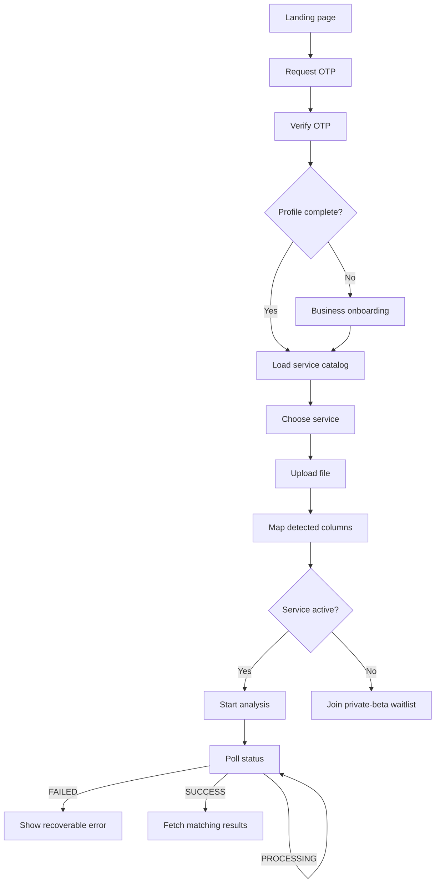

# Frontend API and UX Flow

## Purpose

This guide describes the order in which the frontend should call backend endpoints, which values it should keep, and which UI state each response should produce.

Base API path: `/api/v1/`

Interactive API documentation: `/api/docs/`

## Complete customer journey



## Shared request rules

- Send and receive JSON unless the upload endpoint requires `multipart/form-data`.
- Add `Authorization: Bearer <access_token>` to every application request.
- Do not add the bearer header to OTP requests.
- Store `access_token`, `refresh_token`, `is_profile_complete`, selected service, project ID, analysis type, and detected columns in application state.
- Use the service catalog's mapping definitions; do not hard-code required fields in the UI.
- API UUID path parameters must use the exact `project_id` returned by upload.

## Step 1: Request OTP

```http
POST /api/v1/auth/send-otp/
Content-Type: application/json
```

```json
{
  "phone_number": "09123456789"
}
```

Success response:

```json
{
  "message": "OTP verification code sent successfully.",
  "expires_in_seconds": 120
}
```

UX behavior:

- Show the six-digit verification input.
- Start a 120-second resend timer from `expires_in_seconds`.
- For the MVP, enter `123456`.
- Preserve the phone number for the verification request.

## Step 2: Verify OTP and store tokens

```http
POST /api/v1/auth/verify-otp/
Content-Type: application/json
```

```json
{
  "phone_number": "09123456789",
  "otp_code": "123456"
}
```

Success response:

```json
{
  "access_token": "eyJ...",
  "refresh_token": "eyJ...",
  "is_profile_complete": false
}
```

UX behavior:

- Store both tokens securely.
- Configure the API client to attach the access token.
- If `is_profile_complete` is `false`, open business onboarding.
- If it is `true`, open the authenticated workspace.
- A failed OTP returns `400`; keep the modal open and show the API detail.

## Step 3: Complete the business profile

```http
PUT /api/v1/user/profile/
Authorization: Bearer <access_token>
Content-Type: application/json
```

```json
{
  "company_name": "Chic Boutiques",
  "industry": "fashion",
  "platform": "woocommerce"
}
```

All three fields are required. A successful response is:

```json
{
  "status": "success"
}
```

Mark the profile complete in frontend state and load the service catalog.

## Step 4: Load the service catalog

```http
GET /api/v1/services/
Authorization: Bearer <access_token>
```

Each item has this shape:

```json
{
  "code": "RFM",
  "name_en": "RFM Segmentation",
  "name_fa": "بخش‌بندی هوشمند مشتریان",
  "is_active": true,
  "result_kind": "RFM",
  "required_mapping_fields": [
    "customer_id_column",
    "date_column",
    "invoice_id_column"
  ],
  "optional_mapping_fields": [
    "amount_column"
  ]
}
```

UX behavior:

- Render names from `name_en` or `name_fa` using current locale.
- Render active services as runnable.
- Render inactive services as private beta or coming soon.
- Build mapper drop zones from `required_mapping_fields` and `optional_mapping_fields`.
- Disable the final action until every required field has a selected source column.

Current service mappings:

| Service code | Required mapping keys | Optional mapping keys | Result endpoint |
| --- | --- | --- | --- |
| `RFM` | `customer_id_column`, `date_column`, `invoice_id_column` | `amount_column` | `rfm-results/` |
| `MARKET_BASKET` | `invoice_id_column`, `product_name_column` | `product_category_column`, `quantity_column` | `basket-results/` |
| `PROPENSITY` | `customer_id_column`, `date_column`, `amount_column` | None | `predictive-results/` |
| `ANOMALY` | `invoice_id_column`, `date_column`, `amount_column` | None | `predictive-results/` |

The server catalog remains authoritative because staff can change mappings and availability in Admin.

## Step 5: Upload a source file

```http
POST /api/v1/projects/upload/
Authorization: Bearer <access_token>
Content-Type: multipart/form-data
```

Form fields:

| Field | Type | Value |
| --- | --- | --- |
| `file` | File | `.csv`, `.xls`, or `.xlsx` |
| `title` | String | Customer-visible project name, maximum 100 characters |
| `analysis_type` | String | Selected catalog `code` |

Example response:

```json
{
  "project_id": "8f3b89b4-3d68-4a68-96bf-11a5113f8999",
  "analysis_type": "RFM",
  "detected_columns": [
    "User ID",
    "Invoice Date",
    "Order Total",
    "Invoice Number"
  ]
}
```

UX behavior:

- Save `project_id` immediately.
- Use `detected_columns` as draggable source tokens.
- Do not claim analysis has started; upload only creates a `PENDING` project.
- If the file returns `400`, show the field-level message and allow replacement.

## Step 6: Build the mapping payload

Mapping keys describe backend concepts. Mapping values are exact strings from `detected_columns`.

RFM example:

```json
{
  "mapping": {
    "customer_id_column": "User ID",
    "date_column": "Invoice Date",
    "invoice_id_column": "Invoice Number",
    "amount_column": "Order Total"
  }
}
```

Market Basket example:

```json
{
  "mapping": {
    "invoice_id_column": "Invoice Number",
    "product_name_column": "Product Title",
    "product_category_column": null,
    "quantity_column": "Quantity"
  }
}
```

Send unmapped optional keys as `null`. Never send a missing or empty value for a required key.

## Step 7A: Start an active service

```http
POST /api/v1/projects/{project_id}/start/
Authorization: Bearer <access_token>
Content-Type: application/json
```

Send the mapping object created in the previous step. Success returns `202 Accepted`:

```json
{
  "project_id": "8f3b89b4-3d68-4a68-96bf-11a5113f8999",
  "status": "PROCESSING",
  "message": "Data ingestion complete. Analysis added to Celery queue."
}
```

UX behavior:

- Switch immediately to the processing screen.
- Prevent duplicate start submissions.
- One credit is consumed only after mapping validation succeeds.
- `402` means the customer has no remaining credits.
- `409` means the service is private beta or the project was already submitted.
- `400` with `missing_required_fields` means mapper state does not match the current catalog.

## Step 7B: Join an inactive service waitlist

For `is_active: false`, do not call the start endpoint. Use:

```http
POST /api/v1/projects/{project_id}/join-waitlist/
Authorization: Bearer <access_token>
```

Success response:

```json
{
  "status": "waitlisted",
  "message": "Your request for this automated engine has been registered. Our accounts team will contact you shortly to run an isolated private-beta trial on your raw data."
}
```

Show the confirmation state. Retrying the same project is safe and does not create a duplicate lead.

## Step 8: Poll processing status

```http
GET /api/v1/projects/{project_id}/status/
Authorization: Bearer <access_token>
```

Possible responses:

```json
{"status": "PROCESSING"}
```

```json
{"status": "SUCCESS"}
```

```json
{
  "status": "FAILED",
  "error": "Datetime format in column 'Invoice Date' cannot be parsed."
}
```

Recommended UX behavior:

- Poll every two or three seconds while status is `PROCESSING`.
- Stop polling on `SUCCESS`, `FAILED`, `401`, or `404`.
- On `SUCCESS`, select the result endpoint from `analysis_type`.
- On `FAILED`, show the returned error and provide a new-upload action. A failed project cannot be restarted because start accepts only `PENDING` projects.
- Cancel the polling timer when the page unmounts or the user leaves the project.

## Step 9: Fetch results

### RFM

```http
GET /api/v1/projects/{project_id}/rfm-results/
```

```json
{
  "summary": {
    "total_customers": 12450,
    "churn_rate_percentage": 18.4,
    "repeat_buyer_percentage": 42.7
  },
  "chart_data": [
    {
      "segment": "Loyal Customers",
      "count": 1450,
      "percentage": 11.6
    }
  ],
  "actionable_insights": [],
  "download_excel_url": "downloads/rfm_out_8f3b89b4.xlsx"
}
```

Use summary values for KPI cards and `chart_data` for segment charts. Resolve the export path against the backend media base, normally `/media/`.

### Market Basket

```http
GET /api/v1/projects/{project_id}/basket-results/
```

```json
{
  "rules": [
    {
      "antecedent": "Wireless Headphones",
      "consequent": "Carrying Case",
      "support": 0.12,
      "confidence": 0.82,
      "lift": 3.4
    }
  ]
}
```

Render one rule per row. Higher confidence means the consequent often appears when the antecedent appears. Lift above `1` means the pair occurs together more often than random expectation.

### Purchase Propensity

```http
GET /api/v1/projects/{project_id}/predictive-results/
```

```json
{
  "analysis_type": "PROPENSITY",
  "summary": {
    "customers_scored": 4000,
    "training_accuracy": 0.81,
    "training_roc_auc": 0.84,
    "result_file_path": "downloads/propensity_out_8f3b89b4.xlsx"
  },
  "scores": [
    {
      "customer_id": "C-120",
      "propensity_score": 92.5
    }
  ]
}
```

Scores range from 0 to 100. Display the strongest customers first. Training metrics may be `null` when the engine uses its deterministic fallback.

### Sales Anomaly

```http
GET /api/v1/projects/{project_id}/predictive-results/
```

```json
{
  "analysis_type": "ANOMALY",
  "summary": {
    "total_checked": 45000,
    "anomalies_found": 12,
    "result_file_path": "downloads/anomaly_out_8f3b89b4.xlsx"
  },
  "anomalies_list": [
    {
      "row_index": 1402,
      "invoice_id": "INV-9921",
      "amount": 980000.0,
      "date": "2026-06-20T03:00:00+00:00",
      "anomaly_score": -0.113245
    }
  ]
}
```

Display anomalies as review candidates, not confirmed fraud. More negative anomaly scores indicate stronger model outliers.

## Token refresh

If an authenticated request returns `401`, make one refresh attempt:

```http
POST /api/v1/auth/token/refresh/
Content-Type: application/json
```

```json
{
  "refresh": "<refresh_token>"
}
```

The response contains a new `access` token. Replace the stored access token and retry the original request once. If refresh also fails, clear authentication state and return to sign-in.

## Error handling matrix

| Status | Frontend meaning | Recommended UX |
| --- | --- | --- |
| `400` | Invalid payload, mapping, OTP, or source data | Show field or processing error |
| `401` | Missing or expired access token | Refresh once, otherwise sign out |
| `402` | No analysis credits | Show credit/paywall state |
| `404` | Project does not exist or belongs to another user | Return to workspace |
| `409` | Service inactive or project already submitted | Show private-beta or existing-run state |
| `500` | Unexpected backend failure | Show retry/support message and retain project ID |

## Frontend state model

A project screen can use these states:

```text
idle -> uploading -> mapping -> submitting -> processing -> success
                                      |             |
                                      v             v
                                  waitlisted       failed
```

Keep transport state separate from backend project status. For example, `uploading` and `submitting` are frontend-only states, while `PENDING`, `PROCESSING`, `SUCCESS`, and `FAILED` come from the backend.

## Security and data UX

- Never expose a project result without the authenticated request.
- Do not store raw uploaded file contents in browser persistence.
- Explain that raw uploads are deleted after 48 hours.
- Treat export paths as backend media paths, not trusted external URLs.
- Use the global locale to translate field labels, status text, errors, charts, and RTL/LTR layout; API keys and service codes remain unchanged.
